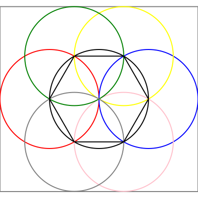

# Cours

## EXERCICE 1

### XML

```xml
<?xml version="1.0.0" encodage="UTF8" ?>
<contacts>
    <contact>
        <id>1<id/>
        <lastname>LARGET<lastname/>
        <firstname>Henri<firstname/>
        <birthdate>1991-12-30<birthdate/>
        <adresse>
            <street1>3 esplanade Augustin Aussedat<street1/>
            <street2>Papeteries Image Factory, Cran-Gevrier<street2/>
            <zip>74000<zip/>
            <city>Annecy<city/>
        <adresse/>
        <family>
            <contact>
                <user>2<user/>
                <status>epouse<status>
            <contact/>
        <family/>
    </contact>
    <contact>
        <id>2<id/>
        <firstname>Nadia<firstname/>
    <contact>
</contacts>    
```

### JSON

```json
[
  {
      "id" : 1,
      "lastname" : "LARGET",
      "firstname" : "Henri",
      "birthdate" : "1991-12-30",
      "adresse" : {
          "street1" : "3 esplanade Augustin Aussedat",
          "street2" : "Papeteries Image Factory, Cran-Gevrier",
          "zip" : "74000",
          "city" : "Annecy"
      },
      "family" : [
        {
            "user" : 2,
            "status" : "epouse"
        }
      ]
  },
  {
      "id" : 2,
      "firstame" : "Nadia"
  }
]   
```

## EXERCICE 2

### JSON

```json
    [
        {
            "matiere" : "Structure de la donnée",
            "note" : 20,
            "type" : "data_struture_tp2",
            "etudiant" : {
                "prenom" : "Loïc",
                "nom" : "Greco"
            }
        }
    ]
```

### CSV

```csv
matiere, note, type, prenom, nom
Structure de la donnée, 20, data_struture_tp2, Loïc, Greco
```

### YAML

```yaml
matiere : "Structure de la donnée"
note : 20
type : "data_struture_tp2"
etudiant : 
    prenom : "Loïc"
    nom : "Greco"
```

La meilleur solution est le csv car etant donner le peu de donner il est plus compact.

## EXERCICE 3

orders.csv

```csv
order_id,lastname,firstname,street1,street2,street3,zip,city
Ar44Zp,HONETE,Marie,3 Esplanades Augustin Aussedat,Papeteries Image Factory,Cran Gevrier,74960,Annecy
RR21P,BON,Jean,1 rue de la paix,,,75000,Paris
```

order_products.csv

```csv
order_id,name,quantity,priceUnit,vat,total
Ar44Zp,clé USB,10,205,410,2460
Ar44Zp,JSON pour les nuls,1,1995,110,2105
RR21P,Comment torturer des étudiants,1,2005,112,2517
RR21P,JSON pour les nuls,1,1995,110,2105
```

## EXERCICE 4

```csv
name,description,prix,categorie,cacahuete,polen
Chocolat,Ce mange,10,dessert,,1
```

```xml
<?xml version="1.0.0" encodage="UTF8" ?>
<plats>
    <plat>
        <name>Chocolat</name>
        <description>Ce mange</description>
        <prix>10</prix>
        <alergens>
            <alergen>cacahuete</alergen>
            <alergen>polen</alergen>
        </alergens>
        <categorie>Dessert</categorie>
    </plat>
</plats>
```

```yaml
name :  Chocolat
description : Ce mange,
prix : 10,
alergenes : 
    - cacahuete
    - polen
categorie : Dessert
```

```json
[
    {
        "name" : "Chocolat",
        "description" : "Ce mange",
        "prix" : 10,
        "alergens" : ["cacahuete","polen"],
        "categorie" : "Dessert"
    }
]
```

## EXERCICE 5

```html
<h1>SCP-101-FR</h1>

<table>
<tr>    
    <td>Objet</td>
    <td>niveau de menace</td>
    <td>Classe</td>
</tr>
<tr>    
    <td>SCP-101-FR</td>
    <td>Rouge</td>
    <td>Keter</td>
</tr>
</table>

<h2>Description</h2>

<strong>SCP-101-FR</strong> est un site internet ayant des capacités de mimétisme numérique. <strong>SCP-101-FR</strong> est considéré comme conscient de par sa capacité à réagir contre une intrusion extérieure (piratage informatique) en envoyant un virus hautement infectieux rendant inutilisable l'ordinateur du pirate, puis en faisant évoluer son code de manière à combler la brèche informatique utilisée par le pirate.

Son seul objectif semble être de dévoiler l'existence de la Fondation aux yeux du monde, c'est pourquoi il faut envisager que <strong>SCP-101-FR</strong> ait pu être créé par un Groupe d'Intérêt connaissant l'existence de la Fondation et cherchant à lui nuire.

<strong>SCP-101-FR</strong> consiste en un site disponible sur l'Internet mondial à l'adresse "<a href="scpwiki.com">scpwiki.com</a>". Ce site se trouve être la réplique quasi-parfaite de l'actuelle base de données de la Fondation. Aucun serveur hébergeant <strong>SCP-101-FR</strong> n'a pu être localisé, toute tentative de remonter jusqu'aux serveurs ayant jusque là aboutit au crash de l'ordinateur effectuant la recherche ou à son infection par un virus informatique.
```

## EXERCICE 6

---
# SCP-871

| Objet       | niveau de menace | Classe   |
|:-----------:|:----------------:|:--------:|
| SCP-871     | Rouge            | Keter    |

Procédures de Confinement Spéciales
Chaque **SCP-871** doit être confiné dans une cellule en béton sur une assiette fixée à une table en bois qui, à son tour, est fixée au sol de la cellule. Il ne doit pas y avoir plusieurs **SCP-871** dans la même cellule. Des caméras doivent être placées dans chaque cellule, qui devra être vérifiée toutes les 15 minutes.

Lors de l'apparition d'un **SCP-871**, Trois (3) membres du personnel de Classe D doivent être escortés par des gardes armés en direction de sa cellule, où ils devront être enfermés avec le **SCP-871**, avant qu'il leur soit demander de le consommer. Les Classe-D ne doivent pas prendre plus d'une (1) heure pour parvenir à consommer l'intégralité d'un **SCP-871**. En cas de motivation supplémentaire requise, l'exécution de l'un des membres de Classe D présents dans la cellule est autorisé. Une fois un **SCP-871** entièrement consommé, Aucun Classe-D n'est autorisé à sortir avant que les gardes aient vérifié qu'aucune trace de **SCP-871** ne soit présente dans la salle où sur eux. L'assiette, la table, et la salle doivent être intégralement nettoyées avant l'arrivée du prochain **SCP-871**.

Tout membre du personnel de Classe D se montrant particulièrement coopératif et acceptant de consommer d'autres **SCP-871** peut être autorisé à le faire. Les Classes-D montrant une utilité exceptionnelle dans la complétion de cette tâche verront leur date d'exécution reportée. Ces derniers ne doivent en aucun cas être utilisés dans des expériences liées à d'autres SCP.

Aucun dessert, de n'importe quel type, ne doit être servi dans les établissements possédant un ou des **SCP-871**.


## Description

**SCP-871** est une collection de 237 cakes. Les **SCP-871** varient énormément en matière de taille et d'apparence. Le plus petit **SCP-871** observé était un cupcake de 15 grammes. Le plus grand était un baumkuchen de vingt-deux (22) kilogrammes de 2 mètres de diamètre.

Lorsqu'un **SCP-871** est consommé par un humain ou groupe d'humains, celui-ci est remplacé par une copie conforme dans un laps de temps de 24 heures. Ce dernier apparaîtra sur une surface plane à proximité de l'endroit où **SCP-871** fut consommé. Si un **SCP-871** est endommagé d'une autre manière qu'en étant consommé par un être humain (être consommé par un être non-humain est considéré comme une autre forme d'endommagement), il sera remplacé instantanément. Les répliques créées de cette manière reprennent un rythme régulier de réparation ou re-création. La façon dont **SCP-871** se recrée est à ce jour incomprise.

Une observation permit de montrer que les différents **SCP-871** "mutaient" au cours du temps, avec quelques modifications mineures dans l'apparence du gâteau au cours de ses nombreuses re-créations, et des modifications plus importantes se produisant dans environ 5 % des re-créations. Aucun effet nuisible n'a jamais été le résultat de la consommation d'un **SCP-871**, même lorsque plusieurs **SCP-871** ont été consommés; la seule exception étant les effets prévisibles après une consommation importante de gâteaux.

Le danger que **SCP-871** représente vient des conséquences amenées par le fait de ne pas le consommer. Tout **SCP-871** n'étant pas digéré par un humain créera un autre **SCP-871** à proximité après 24 heures. Ce processus est similaire à sa méthode de "réparation" ; cependant, les deux versions du **SCP-871** manifesteraient les effets décrits, se "re-créant" toutes les 24 heures, et se dupliquant à nouveau si personne ne venait à les consommer. Cet effet se produira à la place du processus de réparation si au moins 10 % du premier gâteau n'ont pas été consommés. Comme il n'y a aucun moyen connu de stopper le processus de duplication, tout **SCP-871** non confiné pourrait se cloner exponentiellement, devenant très rapidement impossible à contrôler. Aucun plan concret visant à confiner plus de 20 000 **SCP-871** n'a encore été mis au point. Une estimation suggère qu'une brèche de confinement laissant un seul **SCP-871** se décupler rendrait la terre inhabitable en 80 jours.

---

## EXERCICE 6

```html
<svg viewBox="0 0 400 400" xmlns="http://www.w3.org/2000/svg">
  <rect x="0" y="13.4" width="400" height="373.6" stroke="grey" stroke-width="2" fill="none" />
  <circle cx="200" cy="200" r="100" stroke="black" stroke-width="2" fill="none" />
  <circle cx="100" cy="200" r="100" stroke="red" stroke-width="2" fill="none" />
  <circle cx="300" cy="200" r="100" stroke="blue" stroke-width="2" fill="none" />
  <circle cx="250" cy="113.4" r="100" stroke="yellow" stroke-width="2" fill="none" />
  <circle cx="250" cy="286.6" r="100" stroke="pink" stroke-width="2" fill="none" />
  <circle cx="150" cy="113.4" r="100" stroke="green" stroke-width="2" fill="none" />
  <circle cx="150" cy="286.6" r="100" stroke="grey" stroke-width="2" fill="none" />
  <polygon stroke="black" stroke-width="2" fill="none" points="250,113.4 150,113.4  100,200   150,286.6 250,286.6 300,200 " />
</svg>
```



## MODELISATION

```json
[
    {
        "idStudent" : 0,
        "firstname" : "Loïc",
        "lastname" : "greco",
        "series" : [
            {
                "idSeries" : 0,
                "responseQuestion" : [
                    {
                    "idQuestion" : "00",
                    "reponses" : [true,true,true,true],
                    "result" : false
                }
                ...
            ],
            ...
            } 
        ]
        "total" : 39
    }
]
,
[
    {
        "idQuestion" : 0,
        "position" : 1,
        "question" : "text",
        "image" : "monimage",
        "video" : "mavideo",
        "responses" : [
            {
                "idReponse" : 0,
                "reponse" : "la reponse",
                "valid" : true
            }
            ...
        ]
    }
    ...
]
```

